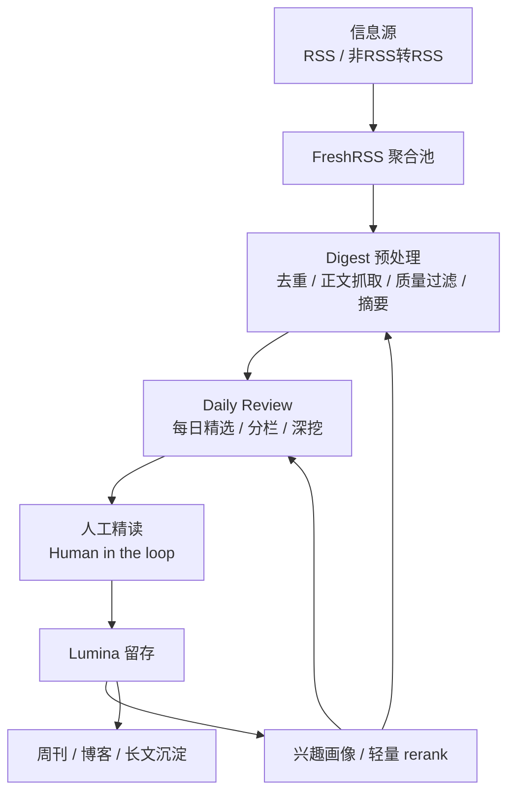
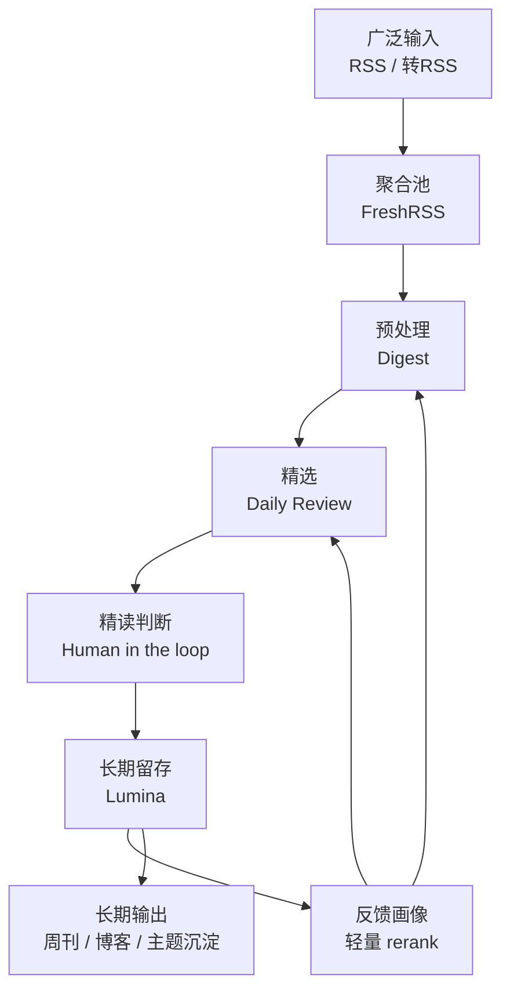

# 2026 年，我是怎么处理信息的

这两年我越来越强烈地感觉到，信息问题早就不是“获取不到”，而是“处理不过来”。

真正让我疲惫的，不是没东西看，而是每天都有太多东西值得看：公众号文章、技术博客、GitHub Release、AI 新闻、社区讨论、长文、短讯、碎片化观点等等，全都在争夺我的注意力。

如果不做点什么，一个人的信息生活很容易退化成这样：

- 收藏了很多，但真正读完的很少
- 看了很多，但真正留下来的很少
- 输入很满，但输出很弱
- 感觉自己一直在吸收信息，实际上只是一直在切换窗口

所以 2026 年，我开始认真整理自己的一套信息处理工作流。

我不需要大而全的平台，也不要一键替我读完互联网的 AI 产品。只需要一套围绕我自己运转的**信息吸收漏斗**：能尽量多接住信息，尽量把噪音和重复先过滤掉，只把真正值得我花时间的内容送到眼前，并把精读后的高价值内容沉淀下来，反过来影响下一轮选择。

不是在追求看得更多，而是在追求**更稳定地吸收、判断和沉淀**。

这篇文章，我将把这套工作流思路完整写下来，包括：

- 为什么我要这样做
- 它是怎么搭起来的
- 每一层分别承担什么职责
- 目前还未闭环的地方和未来优化方向

如果你也在被信息过载折磨，或者你已经有不少输入工具，却还是觉得“每天看了很多，脑子里没留下什么”，那也许这篇文章会有点参考价值。

<!-- more -->

## 为什么我要做一套“信息吸收漏斗”？

我以前也尝试过很多方法：

- 订很多 RSS，然后每天刷
- 把值得看的东西先扔进稍后阅读
- 用收藏、标签、笔记软件把文章存起来
- 靠搜索和回忆去找以前读过的内容

这些工具都不是没用，只是它们通常只解决其中一个环节。比如：

- RSS 解决的是“订阅”
- 稍后阅读解决的是“暂存”
- 笔记软件解决的是“留档”
- AI 总结解决的是“快速浏览”

但个人信息处理真正难的地方，不在某一个点，而在**这些点之间没有连起来**。

久而久之，我越来越清楚地意识到，信息系统如果不能同时解决下面几个问题，就很容易失控：

### 1. 输入太多

几乎每一个你关心的领域，都在持续产生新内容。技术、产品、AI、工具、商业、研究、行业变化，这些信息都很重要。

但问题在于，人没有办法对所有输入都给予同样的注意力。

### 2. 内容没有分层

在未经过滤之前，重要新闻、工具发布、经验复盘、广告软文、标题党、重复报道，往往都混在一起。

如果每一条都靠自己从零判断，那认知负担会非常高。

### 3. 没有预处理

很多时候，人真正累的不是“读一篇长文”，而是反复做这些微小判断：

- 这篇值不值得点开？
- 这条是不是和刚才那条重复？
- 这个标题是不是在夸张？
- 这条到底在说什么？
- 这篇我只是知道一下，还是值得存下来？

这些判断单次都不重，但积累起来会持续消耗注意力。

### 4. 缺少精读回路

很多内容看完就过去了。没有标记、没有沉淀、没有重新进入自己的知识体系。

最后的结果就是：你确实看过，但它并没有真正成为你的东西。

### 5. 系统无法学习你

如果一个系统永远只知道“最新内容是什么”，却不知道“什么内容真正对你有帮助”，那它最多只是个信息输送管道，不是一个越来越懂你的信息系统。

所以我最后给自己的方向，不是做一个“更强的信息池”，而是做一个**更稳的信息漏斗**。

桶的思路是往里装更多。漏斗的思路是让信息在往下走的过程中不断收窄，最后留下真正值得进入大脑和长期记忆的部分。

从结果上说，这套漏斗至少给我带来了几个很明显的变化：

- 我不再需要每天自己从海量标题里徒手捞重点
- 低质量和重复内容大部分在上游就被消化掉了
- 真正值得精读的内容，会在更靠后的层级里被我看到
- 我读过并认为重要的内容，终于开始能反过来影响之后的筛选逻辑

这才是我想要的：不是“更快地刷完”，而是“更稳定地吸收”。

## 如何基于 OpenClaw 把它搭起来？

这套工作流目前不是一个单独的大应用，而是基于 OpenClaw 逐步搭起来的。

在早期阶段，我并不确定这套流程最终会长成什么样。如果一开始就做一个完整系统，可能会很快陷入“工程搭得很大，但流程还没跑顺”的问题里。

所以我走的是另一条路线：先用 OpenClaw 把整条链路串起来，先跑、先验证、先发现问题，再逐步打磨。

OpenClaw 在这套体系里，主要承担的是“编排层”的角色。它负责：

- 定时触发任务
- 串联外部工具和系统
- 负责与 Feishu 的文档交互
- 负责与 Lumina 的联动
- 在需要的地方让 AI 参与结构化生成

这套方法的优点很直接，起步快，改起来快，很适合边跑边迭代，也不需要一开始就做完整前后端。

如果你也想搭一套类似的流程，我觉得至少要先准备这几样东西。

### 1. 一组可持续维护的信息源

这是整个系统的上游。你需要先想清楚：

- 自己真正长期关注的主题是什么
- 这些主题的主要信息源在哪里
- 哪些来源值得长期订阅，哪些只是偶尔看看

这一步不一定要做得很大，但要尽量稳定。

### 2. 一个统一的聚合池

我的聚合池是 FreshRSS。

它的意义不是“作为最终阅读器”，而是让所有来源先汇聚到同一个地方，形成一个可持续消费的候选池。

### 3. 一个自动化编排层

这是 OpenClaw 最适合发挥价值的地方。

我用它来做：

- 定时执行 digest（自定义的预处理skill）
- 定时执行 daily-review（自定义的内容精选skill）
- 发布 Feishu 文档
- 调用 Lumina（个人开源的知识库项目）
- 串起各个技能和脚本

这一步会让整套流程从“偶尔手动跑一遍”变成“能持续运转”。

### 4. 一个长期知识沉淀层

在我的工作流里，这一层是 [Lumina](https://github.com/shawnxie94/lumina)，个人开发的信息管理工作台。

它不负责承接一切，而是只承接我经过筛选后，确认值得保留的内容。

这一步非常重要，因为它会决定后续的反馈质量。一个系统最终能学到什么，很大程度上取决于你给了它什么样的正反馈。

换句话说，前期准备的核心不在于工具数量，而在于你是否把系统的这几个基本角色分清楚了：

- 谁负责接住信息
- 谁负责聚合
- 谁负责预处理
- 谁负责精选
- 谁负责沉淀
- 谁负责反馈回流

角色一旦清晰，后面的实现其实会顺很多。

## 我的信息处理流程

如果把整套系统画成一张图，它大概长这样：

这张图看起来不复杂，但每一层其实都在做一件很具体的事。下面我按顺序展开说：

## 信息源：以 RSS 为主，但不只局限于原生 RSS

整个系统的最上游，是 RSS。

我仍然觉得，RSS 是今天最被低估的一种个人信息基础设施。天然符合个人信息系统最核心的几个要求：

- 订阅权在自己手里
- 来源是明确的
- 更新是结构化的
- 不受平台推荐算法直接支配
- 程序很好接入和处理

只不过现实里，一个问题很快就会冒出来：**不是所有值得看的来源都有 RSS**。比如：

- 一些公众号内容
- 一些网页更新
- 某些社区栏目
- 一些垂直网站或产品更新页
- 某些平台上的账号内容

所以这套工作流需要在信息源进入系统之前，尽量统一转换成 RSS 或近似 feed 的形式。常见的方法包括：

### 1. RSSHub / RSS-Bridge 这一类转换工具

这是最常见的方案。它们的价值就在于把大量原本不提供 RSS 的内容源，变成可被订阅和程序消费的 feed。

### 2. GitHub / 开发者生态自带的 feed

很多开发者关注的信息本来就有很好的 feed 接口，比如：

- GitHub Releases
- Commits
- Discussions
- Issue / PR 动态
- 版本更新日志

这些信息天然结构化，放进系统里效果往往很好。

### 3. 自己做简单的页面更新抓取

对于特别想跟踪、但又没有现成 RSS 方案的页面，也可以直接做一层轻量抓取脚本，再转成内部 feed。

我自己的原则很简单：上游来源可以很多样，但进入系统之前，格式要尽量统一。

因为只有这样，下游的预处理和筛选才能稳定下来。

## 聚合池：用 FreshRSS 做一个稳定的“中间水库”

所有订阅源最后都会进 FreshRSS。

但对我来说，FreshRSS 不是“我每天真正坐下来阅读的地方”，它更像一个中间水库，或者说一个候选池。

我很喜欢把它理解成一个缓冲层：

- 上游信息不断流进来
- 它先帮我统一接住
- 保留未读状态
- 再把结构化候选交给下游处理

这一层的价值其实非常大。

### 第一，它把来源统一起来了

无论内容来自博客、社区、GitHub 还是转换后的 feed，最后都变成同一种可消费对象。

### 第二，它让下游不需要直接面向互联网

digest 不必再去每个网站单独抓“今天更新了什么”，而是只需要从 FreshRSS 这个统一池子里拿未读候选。这会大幅降低耦合度。

### 第三，它保留了时间上的连续性

一套信息系统最怕的是“今天临时看一下、明天忘了、后天又重新捞”。FreshRSS 至少给了一个稳定的时间窗口，让后续任务能比较有节奏地运行。

这也是我为什么会把 FreshRSS 放在前面，而不是直接让 AI 面向整个互联网抓新闻。

我的目标不是“无边界获取”，而是**有边界地处理**。

## 预处理：Digest 负责先把海量候选变成“可判断对象”

如果说 FreshRSS 是蓄水池，那 Digest 就是这套系统里的第一道加工厂。

它不负责替我做最后判断，也不负责产出最精炼的日报，而是先做几件特别关键的事：

- 去掉重复的
- 去掉质量差的
- 尽量拿到正文
- 对内容做摘要
- 让候选从“原始链接”变成“可判断的信息对象”

这一步的重要性，比很多人想象中高得多。

因为一个人每天真正累的地方，往往不是精读一篇高质量文章，而是反复判断很多低质量候选值不值得花时间。

Digest 这层就是用来承接这些认知脏活的。

### 核心处理事项

- URL 精确去重
- 相似内容去重
- 正文抓取
- 质量检查
- 噪音过滤
- 摘要生成
- 初步排序与文档输出

可以把它理解成在真正“阅读”发生之前，先把互联网那层天然混乱的信息整理成一批更像样的候选。

### 这一层为什么重要？

如果没有预处理，后面的所有“精选”都建立在一堆未经整理的标题之上。而经过 Digest 之后，情况会变得很不一样：

- 标题党少了
- 重复报道少了
- 抓不到正文的脏数据少了
- 每条候选至少带着一个可快速判断的摘要

这会让后续阅读成本显著下降。另外，我也不希望 Digest 变成一个单纯按热度推送的系统。我更想要的是能保持内容一定多样性，避免单一来源刷屏和避免同一事件不同标题反复出现。

所以在我的理解里，Digest 的职责不是“编辑终稿”，而是把候选池做干净，把信息对象结构化并给后续精选打底。

这是整套漏斗真正开始工作的地方。

## AI 精选：Daily Review 负责告诉我“今天到底该重点看什么”

如果说 Digest 是把原始候选处理得更可读，那么 Daily Review 做的事情，就是进一步从这些候选里抽出当天真正值得看的一部分。

这一步开始从“预处理”走向“编辑”。它不再追求广，而是追求重点更突出、结构更清晰和读起来更像一份真正的日报，而不是一堆堆起来的摘要。

目前我把 Daily Review 做成了几个固定栏目，把不同类型的信息放到不同认知槽位里，例如：

- 今日大事：看公共重要性
- 变更与实践：看对自己有直接操作意义的内容
- 安全与风险：关注潜在风险
- 开源与工具：看工具生态变化
- 洞察与数据点：关注趋势和变化
- 深挖：把一个主题从新闻拉到趋势层面

这就比单纯一串摘要更像是一个真正可以消费的日报入口。

### 为什么这里需要 AI？

从 Digest 的候选层到 Daily Review 的成稿层，中间有很多适合 AI 做的工作：

- 把同一事件的多个来源合并
- 提炼主题
- 给内容分栏目
- 识别值得深挖的话题
- 把零散候选重组成人类能快速阅读的日报结构

但我对这一步的要求始终是克制的：

AI 在这里不是“全自动写日报”，而是一个**结构化整理者**。

更准确地说，它是在做这件事：从 Digest 处理过的候选里，再挑出当天最值得我花注意力的部分。

所以到这一步，信息才真正从“很多条可能值得看”，变成了“今天可以先看这几件事”。

这对我最大的帮助，是明显降低了每天进入阅读状态的门槛。

以前我需要自己从几十条里挑重点。现在更像是先拿到一份当天的信息骨架，再决定后续往哪几条精读。

## 精读留存：把 Human in the loop 放进系统中心

前面的流程，都是为了把信息送到“值得我认真花时间”的阶段。

但真正让整个系统不至于变成另一种自动化信息流的，是这一层：**Human in the loop**。

我越来越相信，个人知识系统里最不能完全外包的，就是“长期价值判断”。

系统可以帮我做很多事，收集、去重、摘要、聚类、排序和精选。但它不能完全替我决定：

- 哪些内容真的值得进入长期知识库
- 哪些内容会在未来持续有用
- 哪些内容会真正影响我的写作和判断

所以在我的工作流里，Lumina 前面永远有一道人工门槛。我会从之前的产物中挑出真正值得精读和留存的内容存到 Lumina。

这一步看起来很普通，但它其实是整套系统里最关键的“价值确认”动作。

进入 Lumina 的内容，不代表“我看过”，而代表我认为这篇东西值得在未来继续被我使用。

这一步把整个信息系统从“资讯消费”拉向“知识沉淀”。

而且只有当系统拥有这种经过人工确认的高质量样本，后面的反馈画像才有意义。

如果什么都往里存，画像学到的就只是噪音。只有经过选择的沉淀，才能成为真正的正反馈。

## 个人画像：让系统开始学会“什么对我真正有帮助”

如果流程走到 Lumina 就结束，那它仍然只是一个过滤和沉淀系统。

只有在沉淀开始反过来影响上游选择时，才真正开始形成闭环。

所以我加了一层比较克制的兴趣画像逻辑。

我很刻意地控制这层的强度，因为我并不想让整个系统演变成另一个“猜你喜欢”。我只需要它稍微更懂我一点，但不要过度讨好我，仍然保留公共重要性和探索空间。

所以这层画像目前更多做的是**轻量 rerank**。它不会直接决定“以后只看这一类东西”，而是作为一种辅助信号，轻微影响 Digest 和 Daily Review 候选的排序。

这个画像主要会从这些维度慢慢学习：

- 我长期会精读哪些主题
- 哪些来源对我更稳定地产生价值
- 哪些内容格式我更容易认真看
- 哪些东西最后会进入 Lumina

它的目标不是替我封闭世界，而是减少无效信息对注意力的浪费。个性化应该帮助我减少无效判断，而不是帮助我躲进熟悉世界。

我更偏向“轻量引导”，而不是“强控制推荐”。在我的理解里，画像的作用不是覆盖公共重要性，而是作为一个更温和的偏好信号存在。

## 沉淀：把资讯流慢慢变成长期内容资产

如果一套信息系统最后停留在“我今天看了什么”，那它其实还不够完整。我更在意的，是这些内容最后有没有进入我的长期结构里。所以在这套流程里，信息漏斗的终点不是“读完”，而是“沉淀”。目前我会把沉淀往两个方向延伸。

### 1. 自动周刊生成

当系统已经积累了一周的高质量内容后，它就不应该只停留在每天一份日报。一周其实是一个非常适合复盘的节奏。到这个时候，已经有了：

- 一周的 Digest
- 一周的 Daily Review
- 若干被确认过价值的 Lumina 内容
- 一些开始反复出现的主题

这时候去做周刊，就会比纯粹从网页上重新抓热点更有意义。因为它已经带有个人筛选和沉淀痕迹。周刊不只是“本周发生了什么”，更应该是：

- 本周有哪些主题值得记住
- 哪些变化是短期噪音，哪些是长期信号
- 哪些内容以后还值得反复回看

### 2. 基于主题的博客生成

另一个更让我感兴趣的方向，是让系统逐渐识别“哪些主题已经值得写成长文”。

因为信息流里很多内容看起来是离散的，但如果你拉长时间看，会发现它们其实在不断指向同一个主题，比如：

- AI Agent 工程
- 开源工具链变化
- 内容平台分发机制变化
- 隐私、合规与数据治理

一旦一个主题在一段时间内反复出现，而且我多次精读、收藏、沉淀，那么它就不应该继续只是“很多条新闻”，而应该逐渐变成一个可输出的长期主题。

这时候，信息系统才真正和写作、研究、表达连起来。

换句话说，这套流程最后真正想做的，不只是帮助我“消费信息”，而是帮助我把信息逐渐变成周期性复盘、长期主题积累、输出素材和知识资产。

这是我最看重的终局方向。

## 这套“信息吸收漏斗”到底是怎么工作的？

把这套系统浓缩成一句话：用 RSS 尽量广地接住信息，用 FreshRSS 稳定聚合，用 Digest 先做预处理，用 Daily Review 做每日精选，用人工精读决定长期价值，用 Lumina 做知识沉淀，再把这些沉淀反向变成轻量个性化信号。

它的重点从来不是“全自动”，而是**分层**。

分层意味着：

- 不是所有信息都值得精读
- 不是所有信息都值得留存
- 不是所有信息都该被个性化加权
- 不是所有信息都应该直接进入输出

一旦这些层分清楚，系统就不会变成单一维度的推荐流，而会更像一个认知加工流程。

我很喜欢把它想象成下面这个漏斗：

漏斗真正有价值的地方不在于“越来越少”，而在于：

- 上游宽，避免漏掉真正重要的变化
- 中游稳，避免噪音直接冲进注意力系统
- 下游精，避免自己把时间花在不值得精读的内容上
- 回流轻，避免系统慢慢变成信息茧房

我确信个人信息系统最难的不是“如何再接更多源”，而是：

- 什么该进来
- 什么该挡在外面
- 什么该花时间看
- 什么该长期留下
- 什么最后真的进入了你的思考和行动

只有这些问题被拆开，信息处理才会从“被动刷流”变成“主动吸收”。

## 没有完全闭环，但方向越来越清楚

虽然现在这套工作流已经能比较稳定地运行，但它还远远没有到“完成”的状态。

更准确地说，它现在是一个已经跑通主链路、但还没彻底闭环的系统。

已经比较清楚的部分是：

- 信息源和聚合池比较稳定
- Digest 的预处理逻辑已经成型
- Daily Review 的每日精选开始真正有用了
- Lumina 这层沉淀已经开始承担长期价值确认
- 个性化画像已经有了轻量回流的雏形

但接下来我还很想继续补齐几件事。

### 1. 让反馈变得更细

现在最强的反馈信号，主要还是“这篇内容有没有进入 Lumina”。

但理想状态下，我希望系统能逐渐识别更多层次的行为：

- 点开了但没读完
- 读完了但没收藏
- 值得精读
- 值得沉淀
- 最后影响了写作 / 决策 / 实现

这些层次一旦补起来，兴趣画像就会更像真正的画像，而不是一个粗粒度偏好集合。

### 2. 补上负反馈

知道“我喜欢什么”当然重要，但知道“哪些内容看起来相关、实际上总是浪费我时间”同样重要。

这一步如果做好，系统会更快摆脱很多看起来像、实际上没价值的重复信息。

### 3. 继续明确 Digest 和 Daily Review 的边界

我希望它们长期保持这种分工：

- Digest 负责广覆盖和预处理
- Daily Review 负责高信噪比精选和结构化入口

边界越清晰，后续整个系统就越好迭代。

### 4. 让“阅读”更自然地走向“行动”

这是我最关心的一步。

我真正想看到的，不是系统知道我读了什么，而是它开始知道：

- 哪些内容后来进入了周刊
- 哪些内容后来变成了博客
- 哪些内容后来影响了产品使用
- 哪些内容后来转成了实现或输出

一旦这条链路打通，整个系统才真正从“阅读辅助”升级成“认知生产系统”。

### 5. 未来也许会把这套流程进一步抽象出来

目前我还是更倾向于先在现有 OpenClaw 体系里继续迭代，因为这对探索阶段最友好。

但如果这套流程越来越稳定，边界越来越清楚，那之后把其中的“信息处理内核”进一步抽象出来，也会是顺理成章的事情。

只是对现在的我来说，比起立刻产品化，我更关心的是另一件事：

> 先让这套漏斗持续运转，并且越来越懂我。

## 结语

我越来越相信，信息处理的关键，从来不是“看到更多”，而是“让真正重要的东西被自己接住”。

当信息不再只是刷过、略过、忘掉，而是经过筛选、精读、沉淀和反馈，慢慢进入你的知识结构时，你会很明显地感觉到一件事：

你不再只是被动消费信息了。

你开始拥有一套真正属于自己的认知处理系统。